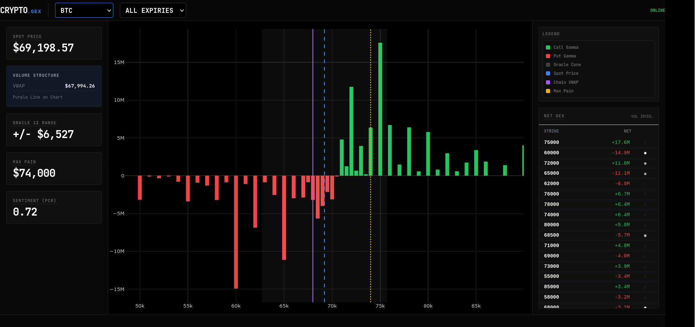

# Crypto.Gex | Options Market Structure Terminal

This terminal provides real-time monitoring of Deribit options liquidity and volatility dynamics. It utilizes a hybrid-compute architecture to identify dealer positioning and price magnets across BTC, ETH, and SOL.



---

## Technical Architecture

The system operates on a split-execution model to balance precision with low-latency updates:

* **Backend (Python/FastAPI):** Executes a closed-form Black-Scholes-Merton (BSM) model to calculate Greeks for every instrument in the Deribit universe. It handles data ingestion, index price tracking, and multi-currency book consolidation.
* **Frontend (Vanilla JS/Plotly):** Performs real-time aggregation of Net Gamma Exposure (GEX) and geometric rendering. This offloads the high-frequency summation of the option chain to the client hardware.

---

## Core Analytics

* **Net Gamma Exposure (GEX):** Calculates the dollar value dealers must hedge per 1% move in the spot price, identifying "Gamma Walls". Calculated as: `Gamma * Open Interest * Spot^2 * 0.01`.
* **Oracle 1-Sigma Range:** Projects the expected move for the current session or specific expiry using a weighted Implied Volatility metric. Calculated as: `Spot * Implied Volatility * sqrt(Time)`.
* **Max Pain and Pinning:** Identifies the strike where option writers lose the least amount of money, serving as a center of gravity for price action near expiration.
* **Volume Structure (VWAP):** Calculates the volume-weighted average strike price across the chain to identify where the bulk of trading activity is concentrated.
* **Sentiment (PCR):** The Put/Call ratio based on open interest. A value > 1 indicates bearish sentiment, while < 0.7 indicates bullish sentiment.
* **Term Structure:** Groups weighted Implied Volatility by expiration date to map out volatility expectations over time.

---

## Data Pipeline Logic

* **Real-Time Ingestion:** Utilizes concurrent fetches via `aiohttp` to consolidate Coin-margined and USDC-margined instruments.
* **Caching:** Implements an in-memory 5-second TTL cache to prevent exceeding Deribit's public API limits of 20 requests per second.
* **Filtering:** Only processes strikes within a 20% to 250% range of the spot price to eliminate illiquid data. Expired contracts are discarded.
* **Risk-Free Rate:** Hardcoded at 5% (0.05) to approximate the cost of carry in crypto-native margin environments.

---

## Implementation Stack

* **Backend Framework:** Python 3.10+ using FastAPI and standard `math` library operations.
* [cite_start]**Dependencies:** Relies on `fastapi`, `uvicorn[standard]`, and `aiohttp`[cite: 2]. [cite_start]Note: While `numpy` is listed in requirements[cite: 2], it is not actively used in the current BSM implementation.
* **Frontend:** Vanilla JavaScript, Tailwind CSS (via CDN), and Plotly.js for geometric rendering.
* [cite_start]**Containerization:** Dockerized via a slim Python 3.10 image.

---

## WebSocket API Integration

The terminal establishes a real-time connection via the `/ws` endpoint.

**Client Subscription Payload:**
```json
{
  "action": "sub",
  "ticker": "BTC"
}
